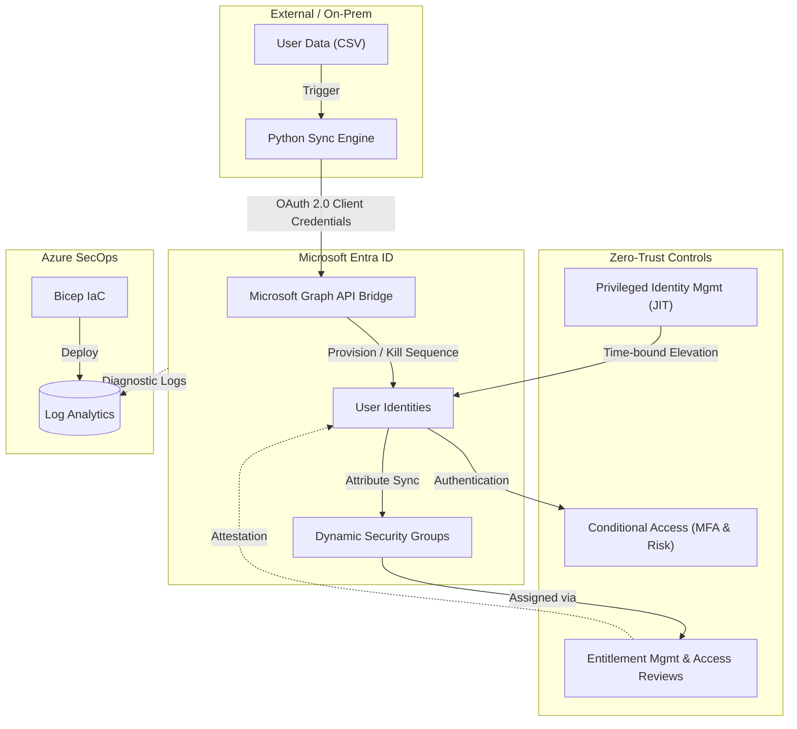

# 🛡️ Azure Governance Framework: Identity Management

Welcome to the **Identity Management** repository. This project is a hands-on, practical runbook designed to eradicate theoretical knowledge by building and breaking Microsoft Entra ID through live attack simulations. 

It serves as a comprehensive architecture lab in preparation for the **SC-300 (Microsoft Identity and Access Administrator)** exam, transitioning a tenant from a legacy state to a programmatic, Zero-Trust environment.

---

## 🎯 Phase 1 Objectives & Achievements

### Week 1 (Days 1–5): Identity Fundamentals
* **Microsoft P2 License Procurement:** Procured the P2 licence trial from M365 Admin Portal.
* **Identity Synchronization:** Created 15-20 users and pushed it into Entra ID using Graph API. `([Day 03 Log](./Day-03-Injection.ps1))`
* **Dynamic Lifecycle Management:** Automated group membership and license binding based on HR attributes. `([Day 04 Log](./Day-04-Execution-log.md))`
* **RBAC:** Provisioned Helpdesk and Security Reader directory roles securely. `([Day 05 Log](./Day-05-Execution-log.md))`

### Week 2 (Days 6–10): Governance & Conditional Access Baseline
* **Telemetry & IaC:** Deployed a Log Analytics workspace for identity telemetry using Azure Bicep. `([Day 06 Log](./Day-06-Execution-log.md))`
* **Entitlement Management:** Built Access Packages for project onboarding and delegated access workflows. `([Day 07 Log](./Day-07-Execution-Log.md))`
* **B2B Collaboration:** Configured Connected Organizations for external guest access scenarios. `([Day 08 Log](./Day-08-Execution-log.md))`
* **Access Reviews:** Configured quarterly recurring reviews for group memberships with auto-revocation (Zero Trust). `([Day 09 Log](./Day-09-Execution-log.md))`
* **Zero-Trust Edge:** Deployed a Conditional Access baseline blocking legacy authentication and enforcing MFA. `([Day 10 Log](./Day-10-Execution-log.md))`

### Week 3 (Days 11–15): Advanced Access Controls & PIM
* **Session Controls:** Enforced strict 12-hour sign-in frequency controls and mandatory Terms of Use. `([Day 11 Log](./Day-11-Execution-log.md))`
* **Risk Governance:** Deployed automated remediation policies for Sign-in Risk and User Risk. `([Day 12 Log](./Day-12-Execution-log.md))`
* **Automated Identity Teardown:** Engineered a programmatic "Kill Sequence" to immediately revoke access for terminated employees. `([Day 13 Log](./Day-13-Execution-log.md))`
* **Privileged Identity Management (PIM):** Eradicated standing privileges, replacing them with Just-In-Time (JIT) eligible assignments bounded by strict time limits and justification requirements. `([Day 14 Log](./Day-14-Execution-log.md))`, `([Day 15 Log](./Day-15-Execution-Log.md))`

### Week 4 (Days 16–20): Workload Identities & API Synchronization
* **Non-Human Identities:** Created Enterprise Applications and securely instantiated Service Principals. `([Day 16 Log](./Day-16-Execution-log.md))`
* **API Bridge:** Built a Workload Identity and generated secure Client Secrets for machine-to-machine authentication. `([Day 17 Log](./Day-17-Execution-log.md))`
* **API Permissions:** Injected high-privilege Microsoft Graph permissions directly onto the Service Principal backend. `([Day 18 Log](./Day-18-Execution-log.md))`
* **Headless Automation:** Built and verified an automated Python engine to synchronize simulated On-Premises HR states into Entra ID via the Graph API. `([Day 19 Log](./Day-19-Execution-log.md))`, `([Day 20 Log](./Day-20-Execution-log.md))`

---

## 🏗️ Architectural Engineering Highlights

Throughout the 20-day deployment, several enterprise-grade engineering practices were enforced:

* **Infrastructure as Code (IaC):** Strict segregation of duties was enforced. The Data Plane (Identity) was managed via **Microsoft Graph PowerShell**, while the Control Plane (Log Analytics / Telemetry) was provisioned using **Azure Bicep**.
* **Zero Standing Access:** "Click-Ops" and permanent administrative assignments were eradicated. Security Groups were converted to **Privileged Access Groups** (PIM for Groups) ensuring a 100% Just-In-Time (JIT) access model.
* **Automated Identity Teardown:** Engineered a programmatic "Kill Sequence" that severs license inheritance, ejects users from dynamic groups, and revokes session tokens the moment a user's department attribute shifts to "Terminated."
* **Advanced Troubleshooting:** Documented and resolved complex deployment blockers, including `.NET` assembly collisions (`TypeLoadException`) between Azure modules, Graph API truncation bugs, and B2B inheritance lockouts.

---

## 📂 Repository Structure

This repository is structured sequentially across 20 days. Each `Day-XX` file represents a specific phase of the architecture rollout:

*   **`.ps1` (PowerShell Scripts):** The Microsoft Graph API and Azure PowerShell scripts used to execute the configurations.
*   **`.bicep` (Infrastructure as Code):** Declarative files used to deploy underlying Azure SecOps telemetry infrastructure.
*   **`.md` (Execution Logs):** Detailed daily runbooks documenting the objective, bugs remediated, scripts executed, and validation results.

---

> *"Identity is the new security perimeter."*
